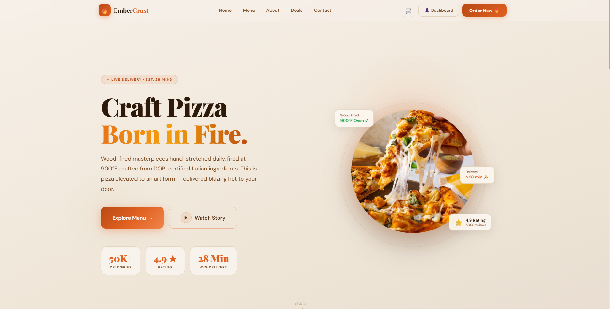
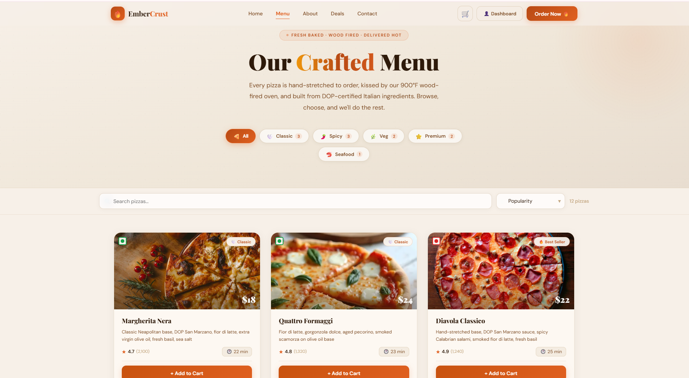
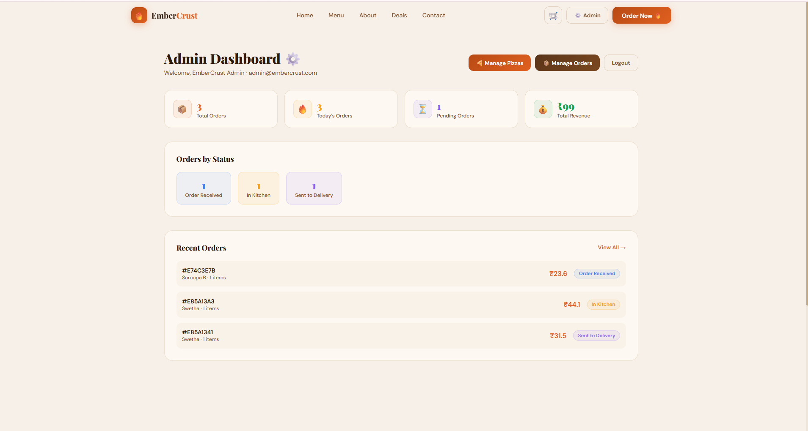

# 🍕 EmberCrust Pizza Delivery App

A full-stack pizza delivery web application built using the MERN Stack.

## Features

### 👤 User Features
* User Registration & Login
* OTP Email Verification
* JWT Authentication
* Browse Pizza Menu
* Search & Filter Pizzas
* Add to Cart
* Razorpay Payment Integration
* Order Tracking

### ⚙️ Admin Features
* Admin Dashboard
* Manage Orders
* Manage Pizza Inventory
* Stock Tracking
* Low Stock Alerts

### 📧 Email Features
* OTP Verification Emails
* Order Confirmation Emails
* Order Status Update Emails
* Low Stock Notification Emails

## Demo Credentials
### 👤 User Access
* Register a new account using your email.
* Verify your account using the OTP sent to your email.
* Login and explore the pizza ordering features.

### ⚙️ Admin Access
**Email:** [admin@embercrust.com](mailto:admin@embercrust.com)
**Password:** admin123

## Tech Stack

### Frontend

* React
* Vite
* Context API

### Backend

* Node.js
* Express.js

### Database

* MongoDB Atlas

### Payment Gateway

* Razorpay

### Authentication

* JWT

## Installation

### Frontend

```bash
cd embercrust-frontend
npm install
npm run dev
```

### Backend

```bash
cd embercrust-backend
npm install
npm start
```

## Screenshots

Add screenshots of:

* Home Page
* Menu Page
* Cart Page
* Checkout Page
* Admin Dashboard

## Project Structure

```text
embercrust/
│
├── embercrust-backend/
├── embercrust-frontend/
└── README.md
```
## Screenshots

### Home Page


### Menu Page


### Admin Dashboard


## Author

**Suroopa B**

Internship Project – Oasis Infobyte (OIBSIP)
